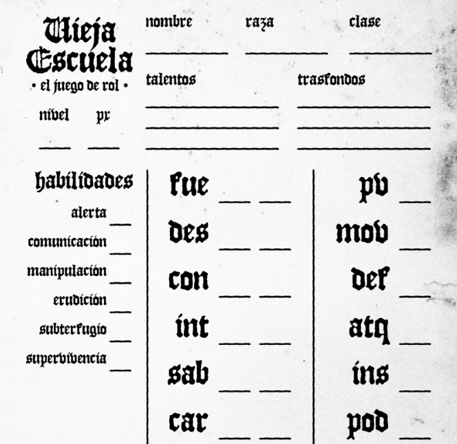
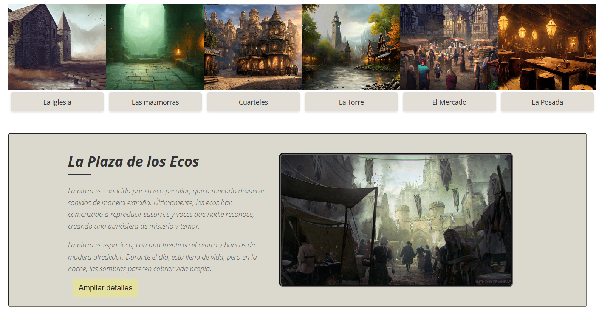
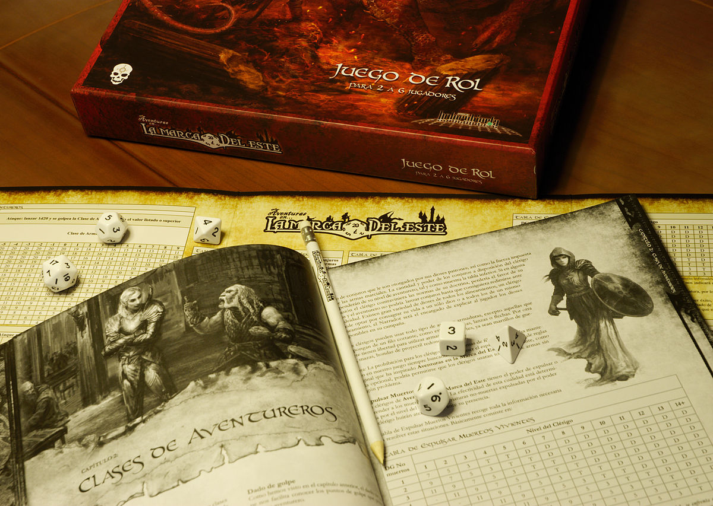

- [¿Qué es Rolify?](#qué-es-rolify)
- [Creación de personajes](#creación-de-personajes)
  - [1. **Personajes prefabricados**](#1-personajes-prefabricados)
  - [2. **Migración de personajes**](#2-migración-de-personajes)
  - [3. **Menos explicaciones, más acción**](#3-menos-explicaciones-más-acción)
- [Creación de escenarios y tramas](#creación-de-escenarios-y-tramas)
  - [1. **Generador de escenarios:**](#1-generador-de-escenarios)
  - [2. **Un generador de tramas:**](#2-un-generador-de-tramas)
- [Salas de acción en tiempo real](#salas-de-acción-en-tiempo-real)
- [Registro de la sesión](#registro-de-la-sesión)
- [Monetización de la app](#monetización-de-la-app)

# ¿Qué es Rolify?

Rolify es una aplicación móvil desarrollada para Android (con Jetpack Compose y utilizando un sistema de almacenamiento local con Sqlite + almacenamiento en la nube con una base de datos PostgreSQL) que pretende agilizar la creación, desarrollo y gestión de partidas de rol. 

Con una batería de herramientas, Rolify pretende simplificar los siguientes aspectos de cualquier partida:

1. Creación de presonajes.
2. Creación de escenarios aleatorios y predefinidos.
3. Generación de tramas narrativas aleatorias y predefinidas.
4. Gestión de eventos y acciones en tiempo real.
5. Registro e historial de cada partida.

# Creación de personajes

Seamos honestos: crear personajes en una sesión de rol es lento, y muchas veces pueden consumir incluso más tiempo que la propia partida en sí. Para empezar, dentro del rol, existen múltiples formas de crear personajes (desde las más complejas como D&D o Aquelarre, basadas en largas listas con Stats y configuraciones infinitas, hasta algunas más simples que se basan en no más de 3 atributos, un inventario y un par de habilidades de una lista cerrada).

La primera idea del desarrollo de esta App es reducir los tiempos de creación de personajes. ¿Cómo? A través de tres propuestas:

## 1. **Personajes prefabricados** 

Utilizar un sistema donde simplemente seleccionado una clase y raza, el personaje ya esté creado y listo para jugar (con sus Stats, habilidades y equipo).
   
## 2. **Migración de personajes**

Crea el personaje para un sistema de juego, y conviértelo automáticamente a otros sistemas. Supongamos que como Game Máster planteas una partida de D&D, sin embargo, para jugadores primerizos, la dinámica es demasiado compleja aún, por lo que decides "migrar cada personaje" a un sistema más sencillo. ¿Y si con solo una llamada a la API, pudieses crear exactamente el mismo personaje para La Vieja Escuela, La Llamada de Chulthu o cualquier otro sistema de juego?

## 3. **Menos explicaciones, más acción** 

Crear una "Sala de Acción" donde el Game Máster tiene acceso directo a la ficha de cada jugador. Esto permite supervisar el correcto funcionamiento de los personajes sin tener que estar explicando la parte más "teórica" de la partida. Aunque de la "Sala de Acción" hablaremos más adelante.

# Creación de escenarios y tramas

¿Cuánto se puede agilizar la creación de una sesión? Muchas veces, el desafío del Game Máster es crear situaciones inesperadas para los jugadores. Sin embargo, la creatividad a veces tiene sus límites. Con esta propuesta se pretende agilizar el proceso creativo a través de dos herramientas:

## 1. **Generador de escenarios:** 

Básicamente una herramienta que permita crear de forma aleatoria un escenario con toda su comnplejidad: ambientación, personajes que lo habitan, situaciones que se pueden dar, etc. De esta forma, el Game Máster puede tener una base sólida sobre la que trabajar y modificar a su gusto.

## 2. **Un generador de tramas:** 

El corazón de la partida deben ser siempre los jugadores: sus acciones son las que deben movilizar la trama (aunque muchas dinámicas todavía se basen en que el Game Máster guía y los jugadores van detrás). El generador de tramas simplemente plantea la creación de un "MacGuffin" para cada situación, es decir, un "motivo narrativo" para que la trama pueda avanzar. Encontrar un cofre, un personaje misterioso, un objeto oculto, una sala secreta, un mensaje de un personaje conocido son algunas situaciones que ayudan a avanzar a la trama pero que no necesariamente tienen que ser el objetivo final de la partida. 

Esta generación aleatoria de escenarios y tramas pueden utilizarse tanto para la planificación de la partida, como una herramienta en tiempo real para partidas improvisadas, donde el peso de los eventos ya no recae tanto en la planificación que se haya realizado de la sesión, sino en la creatividad del Game Máster y en la interacción de los jugadores con el entorno y los personajes que lo habitan, de tal forma que incluso si había un "argumento" o una "trama principal", esta puede ser modificada en tiempo real por las acciones de los jugadores en base a elementos que sean incluso desconocidos para el Director del Juego.

# Salas de acción en tiempo real

Uno de los puntos que más pueden refrenar la experiencia de una partida de rol es la modificación de la ficha por parte de los jugadores, donde el sistema de suma de dados, el entender qué tipo de objeto se ha recibido (o cuánto oro se ha perdido) y los cálculos para resolver cualquier situación puede hacer que la partida se vuelva lenta, tediosa y, sobre el papel y lápiz, algo confusa. 

Para solucionar este aspecto, se propone una sala de acción que permita a los jugadores y al director de juego llevar un control de los turnos y las acciones de los personajes, NPCs, enemigos y situaciones ambientales y que esto quede reflejado en tiempo real dentro de la App de cada jugador.

El objetivo de esta "Sala de Acción" (creada por el Game Máster y a la que pueden acceder todos los jugadores en tiempo real que compartan el mismo token) es precisamente poder organizar la partida de una forma más limpia, permitiendo incluso que el propio Game Máster sea el que, a través de los distintos NPCs, eventos y enemigos, pueda restar, sumar, modificar o aplicar cualquier efecto a la ficha de los personajes de los jugadores y que, estos, en tiempo real, puedan ser avisados del cambio de situación sin que tengan que estar pendientes de sus propias fichas.

A continuación presentamos algunas situaciones que podría modificar el Game Máster de cada uno de los jugadores de la Sala de Acción:

- Un combate en tiempo real (donde es necesario reflejar la pérdida de vida, maná, etc.).
- Destrucción o descubrimiento de objetos (ahora el Game Máster puede entregarlos o quitarlos directamente a los jugadores).
- Pérdida o ganancia de oro.
- Pérdida de cordura o de cualquier stat de manera temporal o permanente.
- Pérdida de habilidades.
- Efectos de estado (veneno, parálisis, etc.) temporales.
- Experiencia, puntos de habilidad, vida, etc.

Que el Game Máster pueda acceder directamente desde su dispositivo a la ficha de cada jugador y modificarla en tiempo real, puede hacer que la experiencia de juego sea mucho más inmersiva y rápida, evitando que los jugadores tengan que estar pendientes de sus propias fichas y de las de los enemigos. 

Además, como efecto secundario, existe un nuevo factor sorpresa por parte del Game Máster, quien en adelante puede modificar la ficha de los jugadores sin que estos sepan qué ha ocurrido o cuando ocurrido. Situaciones como incorporar un parásito o una enfermedad, robar a los jugadores, o incluso recibir alguna bendición o bonificación secreta pueden ayudar a crear una nueva dimensión a la partida de rol.

# Registro de la sesión

Dentro de la Sala de Acción, existe un registro de todas las acciones que se han llevado a cabo en la partida, permitiendo a los jugadores y al Game Máster revisar en cualquier momento qué ha ocurrido en la partida y cómo se ha llegado a una situación concreta. De esta forma pueden solventarse las clásicas discusiones de si cierto estado o situación se llegó a producir o si ya ha concluido.

# Monetización de la app

El proyecto está planteado inicialmente como una App de uso gratuito. Sin embargo, se plantea la posibilidad de monetizar la App a través de dos vías:

- **Contenido premium** : más allá de la generación básica de personajes, escenarios y tramas, se plantea la posibilidad de crear contenido premium que sí sea  de pago, tales como fichas de personaje con diseño especial, escenarios y tramas más complejas o incluso crear aventuras completas. Nuevamente, la venta de este contenido puede ser tanto digital como física.
  
- **Comercialiación de productos asociados** : edición de material físico, manuales y guías de juego, dados, miniaturas, etc que puedan acompañar la sesión de rol.